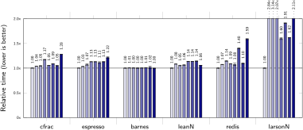
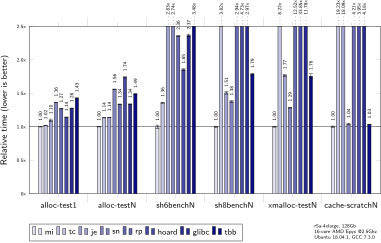
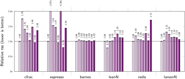

# mi-malloc

&nbsp;

mi-malloc (pronounced "me-malloc")
is a general purpose allocator with excellent performance characteristics.
Initially developed by Daan Leijen for the run-time systems of the
[Koka](https://github.com/koka-lang/koka) and [Lean](https://github.com/leanprover/lean) languages.

It is a drop-in replacement for `malloc` and can be used in other programs
without code changes, for example, on Unix you can use it as:
```
> LD_PRELOAD=/usr/bin/libmimalloc.so  myprogram
```

Notable aspects of the design include:

- __small and consistent__: the library is less than 3500 LOC using simple and
  consistent data structures. This makes it very suitable
  to integrate and adapt in other projects. For runtime systems it
  provides hooks for a monotonic _heartbeat_ and deferred freeing (for
  bounded worst-case times with reference counting).
- __free list sharding__: the big idea: instead of one big free list (per size class) we have
  many smaller lists per memory "page" which both reduces fragmentation
  and increases locality --
  things that are allocated close in time get allocated close in memory.
  (A memory "page" in mimalloc contains blocks of one size class and is
  usually 64KB on a 64-bit system).
- __eager page reset__: when a "page" becomes empty (with increased chance
  due to free list sharding) the memory is marked to the OS as unused ("reset" or "purged")
  reducing (real) memory pressure and fragmentation, especially in long running
  programs.
- __lazy initialization__: pages in a segment are lazily initialized so
  no memory is touched until it becomes allocated, reducing the resident
  memory and potential page faults.
- __bounded__: it does not suffer from _blowup_ \[1\], has bounded worst-case allocation
  times (_wcat_), bounded space overhead (~0.2% meta-data, with at most 16.7% waste in allocation sizes),
  and has no internal points of contention using atomic operations almost
  everywhere.

Enjoy!

# Building

## Windows

Open `ide/vs2017/mimalloc.sln` in Visual Studio 2017 and build.
The `mimalloc` project builds a static library (in `out/msvc-x64`), while the
`mimalloc-override` project builds a DLL for overriding malloc
in the entire program.

## MacOSX, Linux, BSD, etc.

We use [`cmake`](https://cmake.org)<sup>1</sup> as the build system:

- `cd out/release`
- `cmake ../..` (generate the make file)
- `make` (and build)

  This builds the library as a shared (dynamic)
  library (`.so` or `.dylib`), a static library (`.a`), and
  as a single object file (`.o`).

- `sudo make install` (install the library and header files in `/usr/local/lib`  and `/usr/local/include`)


You can build the debug version which does many internal checks and
maintains detailed statistics as:

-  `cd out/debug`
-  `cmake -DCMAKE_BUILD_TYPE=Debug ../..`
-  `make`

   This will name the shared library as `libmimalloc-debug.so`.

Or build with `clang`:

- `CC=clang cmake ../..`

Use `ccmake`<sup>2</sup> instead of `cmake`
to see and customize all the available build options.

Notes:
1. Install CMake: `sudo apt-get install cmake`
2. Install CCMake: `sudo apt-get install cmake-curses-gui`


# Using the library

The preferred usage is including `<mimalloc.h>`, linking with
the shared- or static library, and using the `mi_malloc` API exclusively for allocation. For example,
```
gcc -o myprogram -lmimalloc myfile.c
```

mimalloc uses only safe OS calls (`mmap` and `VirtualAlloc`) and can co-exist
with other allocators linked to the same program.
If you use `cmake`, you can simply use:
```
find_package(mimalloc 1.0 REQUIRED)
```
in your `CMakeLists.txt` to find a locally installed mimalloc. Then use either:
```
target_link_libraries(myapp PUBLIC mimalloc)
```
to link with the shared (dynamic) library, or:
```
target_link_libraries(myapp PUBLIC mimalloc-static)
```
to link with the static library. See `test\CMakeLists.txt` for an example.


You can pass environment variables to print verbose messages (`MIMALLOC_VERBOSE=1`)
and statistics (`MIMALLOC_STATS=1`) (in the debug version):
```
> env MIMALLOC_STATS=1 ./cfrac 175451865205073170563711388363

175451865205073170563711388363 = 374456281610909315237213 * 468551

heap stats:     peak      total      freed       unit
normal   2:    16.4 kb    17.5 mb    17.5 mb      16 b   ok
normal   3:    16.3 kb    15.2 mb    15.2 mb      24 b   ok
normal   4:      64 b      4.6 kb     4.6 kb      32 b   ok
normal   5:      80 b    118.4 kb   118.4 kb      40 b   ok
normal   6:      48 b       48 b       48 b       48 b   ok
normal  17:     960 b      960 b      960 b      320 b   ok

heap stats:     peak      total      freed       unit
    normal:    33.9 kb    32.8 mb    32.8 mb       1 b   ok
      huge:       0 b        0 b        0 b        1 b   ok
     total:    33.9 kb    32.8 mb    32.8 mb       1 b   ok
malloc requested:         32.8 mb

 committed:    58.2 kb    58.2 kb    58.2 kb       1 b   ok
  reserved:     2.0 mb     2.0 mb     2.0 mb       1 b   ok
     reset:       0 b        0 b        0 b        1 b   ok
  segments:       1          1          1
-abandoned:       0
     pages:       6          6          6
-abandoned:       0
     mmaps:       3
 mmap fast:       0
 mmap slow:       1
   threads:       0
   elapsed:     2.022s
   process: user: 1.781s, system: 0.016s, faults: 756, reclaims: 0, rss: 2.7 mb
```

The above model of using the `mi_` prefixed API is not always possible
though in existing programs that already use the standard malloc interface,
and another option is to override the standard malloc interface
completely and redirect all calls to the _mimalloc_ library instead.


# Overriding Malloc

Overriding the standard `malloc` can be done either _dynamically_ or _statically_.

## Dynamic override

This is the recommended way to override the standard malloc interface.

### Unix, BSD, MacOSX

On these systems we preload the mimalloc shared
library so all calls to the standard `malloc` interface are
resolved to the _mimalloc_ library.

- `env LD_PRELOAD=/usr/lib/libmimalloc.so myprogram` (on Linux, BSD, etc.)
- `env DYLD_INSERT_LIBRARIES=usr/lib/libmimalloc.dylib myprogram` (On MacOSX)

  Note certain security restrictions may apply when doing this from
  the [shell](https://stackoverflow.com/questions/43941322/dyld-insert-libraries-ignored-when-calling-application-through-bash).

You can set extra environment variables to check that mimalloc is running,
like:
```
env MIMALLOC_VERBOSE=1 LD_PRELOAD=/usr/lib/libmimalloc.so myprogram
```
or run with the debug version to get detailed statistics:
```
env MIMALLOC_STATS=1 LD_PRELOAD=/usr/lib/libmimalloc-debug.so myprogram
```

### Windows

On Windows you need to link your program explicitly with the mimalloc
DLL, and use the C-runtime library as a DLL (the `/MD` or `/MDd` switch).
To ensure the mimalloc DLL gets loaded it is easiest to insert some
call to the mimalloc API in the `main` function, like `mi_version()`.

Due to the way mimalloc intercepts the standard malloc at runtime, it is best
to link to the mimalloc import library first on the command line so it gets
loaded right after the universal C runtime DLL (`ucrtbase`). See
the `mimalloc-override-test` project for an example.


## Static override

On Unix systems, you can also statically link with _mimalloc_ to override the standard
malloc interface. The recommended way is to link the final program with the
_mimalloc_ single object file (`mimalloc-override.o` (or `.obj`)). We use
an object file instead of a library file as linkers give preference to
that over archives to resolve symbols. To ensure that the standard
malloc interface resolves to the _mimalloc_ library, link it as the first
object file. For example:

```
gcc -o myprogram mimalloc-override.o  myfile1.c ...
```


# Performance

_Tldr_: In our benchmarks, mimalloc always outperforms
all other leading allocators (jemalloc, tcmalloc, hoard, and glibc), and usually
uses less memory (with less then 25% more in the worst case) (as of Jan 2019).
A nice property is that it does consistently well over a wide range of benchmarks.

Disclaimer: allocators are interesting as there is no optimal algorithm -- for
a given allocator one can always construct a workload where it does not do so well.
The goal is thus to find an allocation strategy that performs well over a wide
range of benchmarks without suffering from underperformance in less
common situations (which is what our second benchmark set tests for).


## Benchmarking

We tested _mimalloc_ with 5 other allocators over 11 benchmarks.
The tested allocators are:

- **mi**: The mimalloc allocator (version tag `v1.0.0`).
- **je**: [jemalloc](https://github.com/jemalloc/jemalloc), by [Jason Evans](https://www.facebook.com/notes/facebook-engineering/scalable-memory-allocation-using-jemalloc/480222803919) (Facebook);
  currently (2018) one of the leading allocators and is widely used, for example
  in BSD, Firefox, and at Facebook. Installed as package `libjemalloc-dev:amd64/bionic 3.6.0-11`.
- **tc**: [tcmalloc](https://github.com/gperftools/gperftools), by Google as part of the performance tools.
  Highly performant and used in the Chrome browser. Installed as package `libgoogle-perftools-dev:amd64/bionic 2.5-2.2ubuntu3`.
- **jx**: A compiled version of a more recent instance of [jemalloc](https://github.com/jemalloc/jemalloc).
      Using commit ` 7a815c1b` ([dev](https://github.com/jemalloc/jemalloc/tree/dev), 2019-01-15).
- **hd**: [Hoard](https://github.com/emeryberger/Hoard), by Emery Berger \[1].
      One of the first multi-thread scalable allocators.
      ([master](https://github.com/emeryberger/Hoard), 2019-01-01, version tag `3.13`)
- **mc**: The system allocator. Here we use the LibC allocator (which is originally based on
      PtMalloc). Using version 2.27. (Note that version 2.26 significantly improved scalability over
      earlier versions).

All allocators run exactly the same benchmark programs and use `LD_PRELOAD` to override the system allocator.
The wall-clock elapsed time and peak resident memory (_rss_) are
measured with the `time` program. The average scores over 5 runs are used
(variation between runs is very low though).
Performance is reported relative to mimalloc, e.g. a time of 106% means that
the program took 6% longer to finish than with mimalloc.

## On a 16-core AMD EPYC running Linux

Testing on a big Amazon EC2 instance ([r5a.4xlarge](https://aws.amazon.com/ec2/instance-types/))
consisting of a 16-core AMD EPYC 7000 at 2.5GHz
with 128GB ECC memory, running	Ubuntu 18.04.1 with LibC 2.27 and GCC 7.3.0.


The first benchmark set consists of programs that allocate a lot:




Memory usage:




The benchmarks above are (with N=16 in our case):

- __cfrac__: by Dave Barrett, implementation of continued fraction factorization:
  uses many small short-lived allocations. Factorizes as `./cfrac 175451865205073170563711388363274837927895`.
- __espresso__: a programmable logic array analyzer \[3].
- __barnes__: a hierarchical n-body particle solver \[4]. Simulates 163840 particles.
- __leanN__: by Leonardo de Moura _et al_, the [lean](https://github.com/leanprover/lean)
  compiler, version 3.4.1, compiling its own standard library concurrently using N cores (`./lean --make -j N`).
  Big real-world workload with intensive allocation, takes about 1:40s when running on a
  single high-end core.
- __redis__: running the [redis](https://redis.io/) 5.0.3 server on
  1 million requests pushing 10 new list elements and then requesting the
  head 10 elements. Measures the requests handled per second.
- __alloc-test__: a modern [allocator test](http://ithare.com/testing-memory-allocators-ptmalloc2-tcmalloc-hoard-jemalloc-while-trying-to-simulate-real-world-loads/)
  developed by by OLogN Technologies AG at [ITHare.com](http://ithare.com). Simulates intensive allocation workloads with a Pareto
  size distribution. The `alloc-testN` benchmark runs on N cores doing 100&times;10<sup>6</sup>
  allocations per thread with objects up to 1KB in size.
  Using commit `94f6cb` ([master](https://github.com/node-dot-cpp/alloc-test), 2018-07-04)

We can see mimalloc outperforms the other allocators moderately but all
these modern allocators perform well.
In `cfrac`, mimalloc is about 13%
faster than jemalloc for many small and short-lived allocations.
The `cfrac` and `espresso` programs do not use much
memory (~1.5MB) so it does not matter too much, but still mimalloc uses  about half the resident
memory of tcmalloc (and 4&times; less than Hoard on `espresso`).

_The `leanN` program is most interesting as a large realistic and concurrent
workload and there is a 6% speedup over both tcmalloc and jemalloc._ (This is
quite significant: if Lean spends (optimistically) 20% of its time in the allocator
that implies a 1.5&times; speedup with mimalloc).
The large `redis` benchmark shows a similar speedup.

The `alloc-test` is very allocation intensive and we see the largest
diffrerences here when running with 16 cores in parallel.

The second benchmark tests specific aspects of the allocators and
shows more extreme differences between allocators:


The benchmarks in the second set are (again with N=16):

- __larson__: by Larson and Krishnan \[2]. Simulates a server workload using 100
   separate threads where
   they allocate and free many objects but leave some objects to
   be freed by other threads. Larson and Krishnan observe this behavior
   (which they call _bleeding_) in actual server applications, and the
   benchmark simulates this.
- __sh6bench__: by [MicroQuill](http://www.microquill.com) as part of SmartHeap. Stress test for
   single-threaded allocation where some of the objects are freed
   in a usual last-allocated, first-freed (LIFO) order, but others
   are freed in reverse order. Using the public [source](http://www.microquill.com/smartheap/shbench/bench.zip) (retrieved 2019-01-02)
- __sh8bench__: by [MicroQuill](http://www.microquill.com) as part of SmartHeap. Stress test for
  multithreaded allocation (with N threads) where, just as in `larson`, some objects are freed
  by other threads, and some objects freed in reverse (as in `sh6bench`).
  Using the public [source](http://www.microquill.com/smartheap/SH8BENCH.zip) (retrieved 2019-01-02)
- __cache-scratch__: by Emery Berger _et al_ \[1]. Introduced with the Hoard
  allocator to test for _passive-false_ sharing of cache lines: first some
  small objects are allocated and given to each thread; the threads free that
  object and allocate another one and access that repeatedly. If an allocator
  allocates objects from different threads close to each other this will
  lead to cache-line contention.

In the `larson` server workload mimalloc is 2.5&times; faster than
tcmalloc and jemalloc which is quite surprising -- probably due to the object
migration between different threads. Also in `sh6bench` mimalloc does much
better than the others (more than 4&times; faster than jemalloc).
We cannot explain this well but believe it may be
caused in part by the "reverse" free-ing in `sh6bench`. Again in `sh8bench`
the mimalloc allocator handles object migration between threads much better .

The `cache-scratch` benchmark also demonstrates the different architectures
of the allocators nicely. With a single thread they all perform the same, but when
running with multiple threads the allocator induced false sharing of the
cache lines causes large run-time differences, where mimalloc is
20&times; faster than tcmalloc here. Only the original jemalloc does almost
as well (but the most recent version, jxmalloc, regresses). The
Hoard allocator is specifically designed to avoid this false sharing and we
are not sure why it is not doing well here (although it still runs almost 5&times;
faster than tcmalloc and jxmalloc).

## Benchmarks on a 4-core Intel workstation


# References

- \[1] Emery D. Berger, Kathryn S. McKinley, Robert D. Blumofe, and Paul R. Wilson.
   _Hoard: A Scalable Memory Allocator for Multithreaded Applications_
   the Ninth International Conference on Architectural Support for Programming Languages and Operating Systems (ASPLOS-IX). Cambridge, MA, November 2000.
   [pdf](http://www.cs.utexas.edu/users/mckinley/papers/asplos-2000.pdf)


- \[2] P. Larson and M. Krishnan. _Memory allocation for long-running server applications_. In ISMM, Vancouver, B.C., Canada, 1998.
      [pdf](http://citeseemi.ist.psu.edu/viewdoc/download;jsessionid=5F0BFB4F57832AEB6C11BF8257271088?doi=10.1.1.45.1947&rep=rep1&type=pdf)

- \[3] D. Grunwald, B. Zorn, and R. Henderson.
  _Improving the cache locality of memory allocation_. In R. Cartwright, editor,
  Proceedings of the Conference on Programming Language Design and Implementation, pages 177–186, New York, NY, USA, June 1993.
  [pdf](http://citeseemi.ist.psu.edu/viewdoc/download?doi=10.1.1.43.6621&rep=rep1&type=pdf)

- \[4] J. Barnes and P. Hut. _A hierarchical O(n*log(n)) force-calculation algorithm_. Nature, 324:446-449, 1986.
